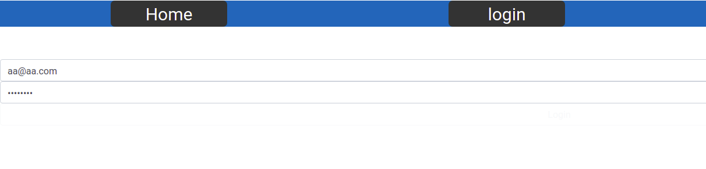
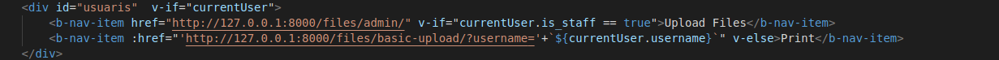
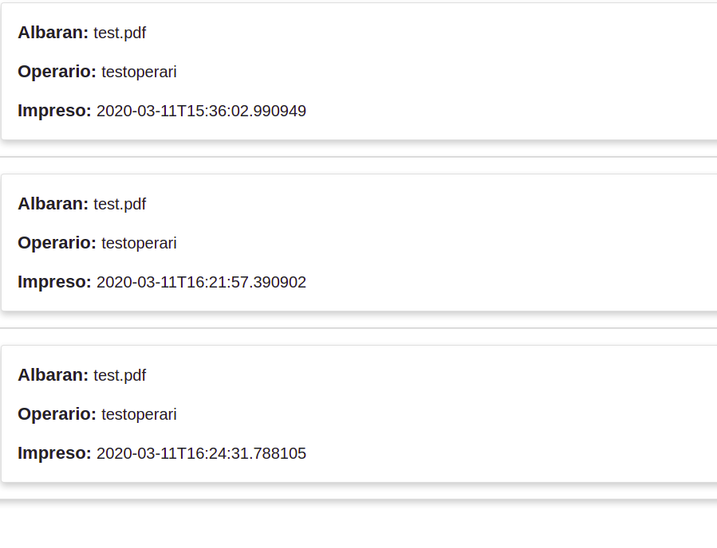
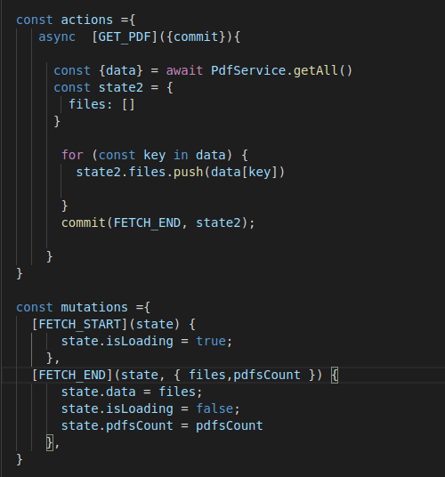
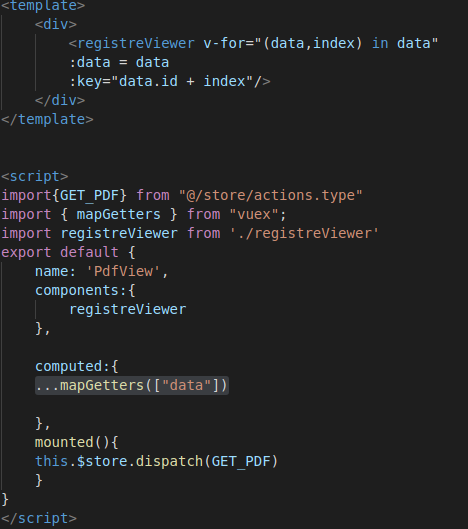
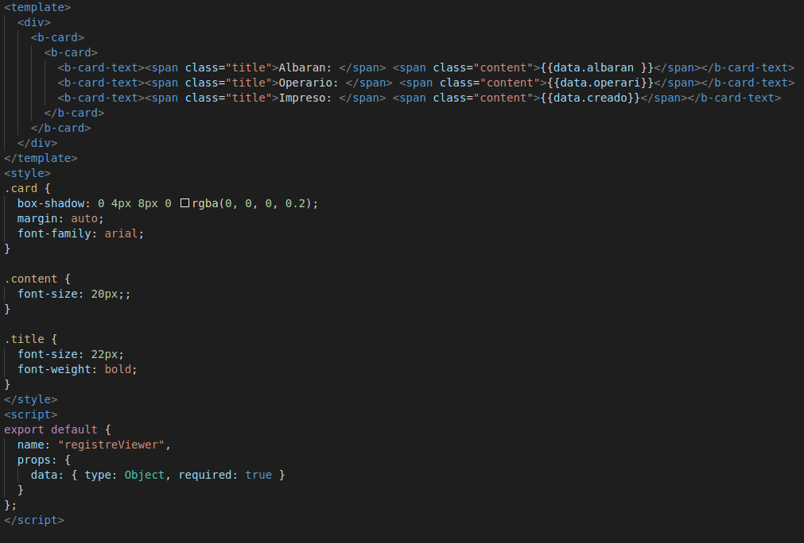

# VUE FRONTEND

- [Angel](https://github.com/vaoangel)
- [Juanan](https://github.com/juanantoniogisbert)

## Instalación
    git clone https://github.com/vaoangel/vue_frontend.git

    cd vue_frontend

    npm install

    npm run serve

En el comando "npm install" instalamos todas las dependencias y librerias necesarias para la aplicacion, con el siguiente comando encedemos la misma

## Descripción 

La aplicacion de VUE utiliza el backend Django.

 - https://github.com/juanantoniogisbert/backend_django-001.git

En esta aplicación cogemos todos los datos que nos envian desde el servidor de Django.

### Authentication

* Login

Una vez logueados depende del tipo de usuario se mostrará un menu o otro.
Este menú es para usuarios normales

Aqui podemos apreciar que si currentUser.is_staff es igual a true se muestra un link y sino se muestra otro

* Pdfs

 Podemos encontrar un listado del registro de los documentos que ha imprimido cada usuario con una breve informacion.Esta página estará disponible solo para los usuarios de tipo administrador

 Para los usuarios normales se les dispone de un link que les lleva a una página del backend en la que podrán imprimir los albaranes subidos por un administrador

  Aqui podemos ver como se procesa la información desde que llega por el PDFService hasta que se cambia el state del componente con la información que llega del servidor

 Aqui podemos observar como el componente recoje los datos con `...mapGetters(["data"])` y los envia con un `v-for` a otra view

Por último se recoje la información en otro componente para mostrarla.

