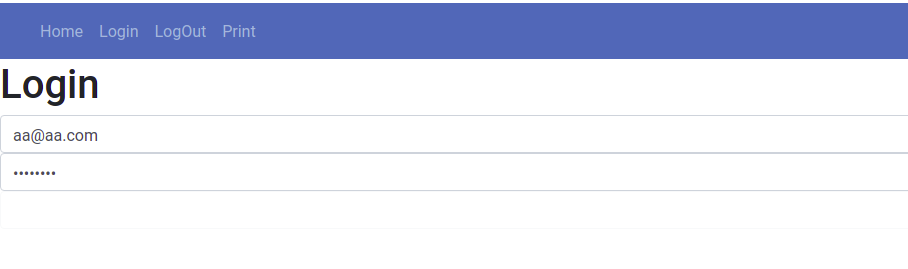

# VUE FRONTEND

- [Angel](https://github.com/vaoangel)
- [Juanan](https://github.com/juanantoniogisbert)

## Instalación
    git clone https://github.com/vaoangel/vue_frontend.git

    cd vue_frontend

    npm install

    npm run serve

En el comando "npm install" instalamos todas las dependencias y librerias necesarias para la aplicacion, con el siguiente comando encedemos la misma

## Descripción 

La aplicacion de VUE utiliza el backend Django.

 - https://github.com/juanantoniogisbert/backend_django-001.git

En esta aplicación cogemos todos los datos que nos envian desde el servidor de Django.
- Pdfs: podemos encontrar un listado del registro de los documentos que ha imprimido cada usuario con una breve informacion.

### Authentication

* Login

Una vez logueados depende del tipo de usuario se mostrará un menu o otro

### Menú para usuarios normales